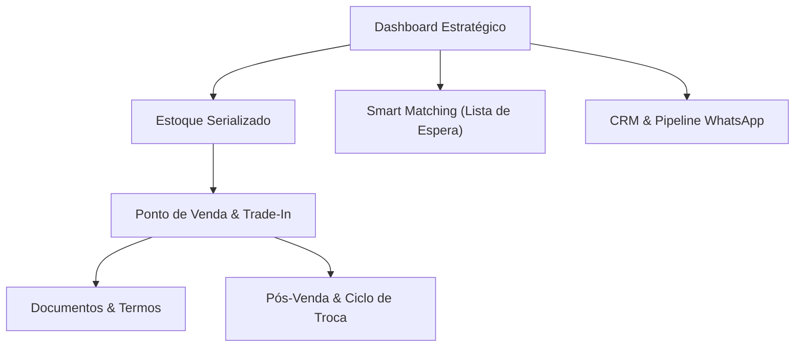

# 📱 iLion Apple Specialist — Sistema Integrado de Gestão, PDV & Trade-In
### Guia Completo de Recursos, Funcionalidades e Vantagens Comerciais

---

## 🎯 Visão Geral da Ferramenta

O **iLion Apple Specialist** é uma plataforma desenvolvida sob medida para a realidade de **lojas, assistências e revendedores especializados em produtos Apple (novos e seminovos)**. 

Diferente de sistemas genéricos de varejo, a ferramenta resolve as dores específicas do mercado Apple:
- Rastreamento individual por **IMEI / Serial**;
- Saúde de bateria e checklist técnico;
- **Trade-In ágil** (usado como entrada) com proteção jurídica;
- **Smart Matching** entre lista de espera e estoque;
- Funil de vendas integrado com WhatsApp;
- Sincronização em nuvem e alta velocidade operacional.

---

## 🧭 Módulos e Funcionalidades Detalhadas

---

### 1. 📊 Dashboard Gerencial em Tempo Real
O painel de controle central permite acompanhar a saúde financeira do negócio com um clique:
- **Filtros por Período**: Visualize dados de **Hoje**, **Última Semana**, **Mês Atual**, **Mês Passado**, **Últimos 90 Dias**, **Este Ano** ou **Todo o Histórico**.
- **Métricas Chave (KPIs)**:
  - **Faturamento Real**: Total líquido recebido em vendas no período.
  - **Lucro Bruto Acumulado**: Lucro real após descontar o custo exato de cada aparelho.
  - **Volume de Vendas**: Quantidade de aparelhos comercializados.
  - **Capital em Estoque**: Total investido em aparelhos ativos à pronta entrega.
  - **Lucro Projetado do Estoque**: Estimativa de ganho com base nos preços sugeridos.
- **Painéis de Ação Imediata**:
  - **Matches de Encomendas**: Aparelhos em estoque que atendem desejos de clientes.
  - **Alertas de Garantia Balcão**: Vendas cuja garantia vence nos próximos 15 dias.
  - **Oportunidades de Ciclo de Troca**: Clientes que compraram há ~12 meses prontos para upgrade.

---

### 2. 📱 Estoque Serializado & Checklist Técnico
Controle absoluto de cada iPhone, iPad, Mac ou Apple Watch individualmente:
- **Rastreamento por Serial / IMEI**: Cada unidade possui identificação única, acabando com a mistura de custos ou históricos.
- **Saúde e Ciclos da Bateria**: Exibição visual com anel de progresso estilo iOS e registro de ciclos de recarga.
- **Classificação Estética**: Novo Lacrado, Grau A+ (Impecável), Grau A (Excelente), Grau B (Leves marcas) ou Grau C.
- **Checklist Técnico de Entrada**:
  - Tela original
  - Face ID / Touch ID ativo
  - Câmeras e lentes ok
  - True Tone funcional
  - Carcaça sem trincas ou amassados
- **Gestão Financeira Unitária**:
  - Custo de compra + Custos de revisão/peças.
  - Preço sugerido de venda e Preço mínimo aceitável (evita que o vendedor dê desconto além do permitido).
  - Cálculo automático da margem de lucro de cada aparelho.
- **Origem Rastreada**: Identifica se veio de compra com fornecedor, Trade-In de cliente ou consignação.
- **Edição e Exclusão Seguras**: Edite especificações a qualquer momento. Exclusões possuem trava de segurança (aparelhos já vendidos não podem ser apagados por acidente).

---

### 3. 💳 Ponto de Venda (PDV) com Trade-In Integrado
Checkout completo, rápido e sem burocracia, finalizado em menos de 1 minuto:
- **Venda Direta**: Seleção do aparelho e cliente cadastrado, com cálculo instantâneo de margem e lucro bruto.
- **Trade-In no Balcão (Aparelho de Entrada)**:
  - O cliente entrega o iPhone usado como parte do pagamento.
  - O valor avaliado é deduzido imediatamente do total a pagar.
  - O aparelho recebido entra no estoque automaticamente com status `Em Manutenção/Revisão` para inspeção técnica e futura revenda.
- **Garantia Balcão**: Definição flexível da garantia (3 meses, 6 meses, 1 ano) com cálculo automático da data limite.
- **Formas de Pagamento**: PIX, Cartão de Crédito/Débito, Dinheiro ou Misto.

---

### 4. 📄 Termo Oficial de Cessão & Comprovantes de Venda
Proteção total contra riscos legais na compra de usados:
- **Termo de Declaração, Compra e Cessão de Propriedade**:
  - Gerado automaticamente na finalização da venda com Trade-In.
  - Contém qualificação completa do cliente (Nome, CPF, Telefone), descrição do aparelho entregue (IMEI/Serial) e valor acordado.
  - **Cláusula jurídica de responsabilidade (Art. 180 e 299 do Código Penal)**: O cliente declara formalmente posse lícita, ausência de bloqueios judiciais, queixas de furto/roubo e liberação completa de iCloud/Apple ID.
  - Pronto para impressão e assinatura física ou digital.
- **Comprovante de Venda**: Recibo limpo e profissional para imprimir ou encaminhar em PDF direto no WhatsApp do cliente.

---

### 5. 🎯 Smart Matching (Cruzamento Estoque x Encomendas)
Um robô comercial em tempo real que transforma falta de estoque em vendas futuras:
- **Lista de Espera / Encomendas**: Registre o que o cliente procura (ex: *iPhone 15 Pro Max 256GB Titânio até R$ 6.500*).
- **Match Automático**: Assim que um aparelho compatível entra no estoque (seja por compra ou Trade-In), o sistema cruza modelo, capacidade, cor e orçamento.
- **Aviso Imediato**: O status da encomenda muda instantaneamente para **"Compatível Encontrado"**.
- **Venda Rápida**: Botão integrado de WhatsApp para avisar o cliente antes mesmo do aparelho ir para a vitrine.

---

### 6. 💼 CRM & Funil de Vendas (Kanban Apple)
Organização simples e visual de todas as negociações em andamento:
- **Etapas do Funil**:
  1. *Novo Contato*
  2. *Em Negociação*
  3. *Aguardando Aparelho/Trade-in*
  4. *Aprovado/Fechado*
  5. *Perdido*
- **Ações Rápidas**:
  - Mover leads entre etapas com um toque.
  - Botão **Conversar** que abre o WhatsApp do cliente com texto inicial preparado.
  - Anotações de preferências e histórico de atendimento.
  - Exclusão e edição simplificadas de negociações.

---

### 7. 🔄 Pós-Venda & Ciclo Anual de Upgrade
Fidelização contínua para garantir receita recorrente:
- **Alertas de Garantia**: Avisa quando a garantia de balcão de um cliente está próxima do fim, permitindo contato proativo de suporte e satisfação.
- **Radar de Troca Anual**: O sistema filtra clientes que compraram há 10 a 14 meses e dispara lembretes com sugestão de contato via WhatsApp para oferecer a nova geração de iPhones (*"Seu iPhone atual vale como entrada no novo modelo"*).

---

### 8. 👥 Cadastro Unificado de Clientes
- Nome, CPF, WhatsApp, E-mail e Endereço.
- Registro automático do aparelho atual que o cliente está utilizando.
- Histórico completo de compras e trocas vinculadas ao CPF.
- Edição rápida e proteção relacional (impede apagar clientes com vendas registradas).

---

### 9. ☁️ Arquitetura Híbrida: Velocidade Local + Supabase Cloud
- **Offline-First & Alta Velocidade**: O sistema roda localmente sem depender de conexões lentas no balcão. Nenhuma tela trava durante o atendimento.
- **Backup & Sincronização Supabase**: Todos os cadastros, vendas, movimentações de estoque e exclusões são espelhados em tempo real na nuvem do Supabase.
- **Segurança de Dados**: Mesmo que a máquina seja trocada, os dados estão salvos e estruturados em banco relacional seguro (PostgreSQL na nuvem).

---

## 🏆 Vantagens Competitivas para o Lojista

| Benefício | Como o Sistema Resolve | Impacto no Caixa |
| :--- | :--- | :---: |
| **Fim do Prejuízo no Trade-In** | Cálculo de margem na hora da negociação e valor de revenda sugerido. | **+15% a +25%** de margem em usados |
| **Blindagem Jurídica** | Termo de cessão e procedência lícita pronto com dados do cliente e IMEI. | **Zero risco** de perdas policiais ou cíveis |
| **Vendas que Não se Perdem** | Smart Matching alerta imediatamente quando o aparelho encomendado chega. | **+30%** de conversão em clientes de espera |
| **Controle de Garantias e Peças** | Histórico de custo de manutenção por aparelho e controle de vencimento. | **Redução de 40%** em retrabalhos e disputas |
| **Recompra Garantida Todo Ano** | Motor de ciclo de troca avisa quando é hora de vender o próximo iPhone. | **Aumento do LTV** (Lifetime Value do cliente) |
| **Agilidade no Balcão** | Visual limpo, inspirado no design do iOS, sem menus complexos. | Atendimento feito em **menos de 2 minutos** |

---

## 💡 Resumo em uma Frase
> *"O iLion Apple Specialist não é apenas um sistema de estoque: é uma máquina de vendas e segurança jurídica pensada exatamente para o dia a dia de quem compra, vende e troca produtos Apple."*
